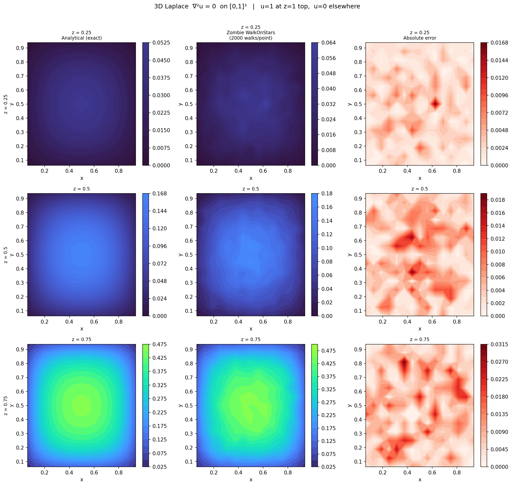
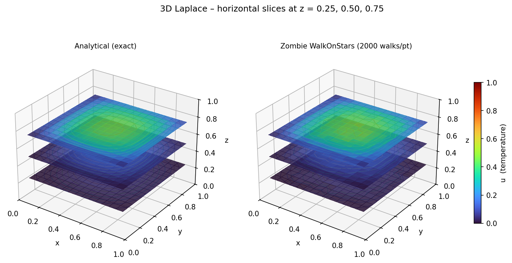
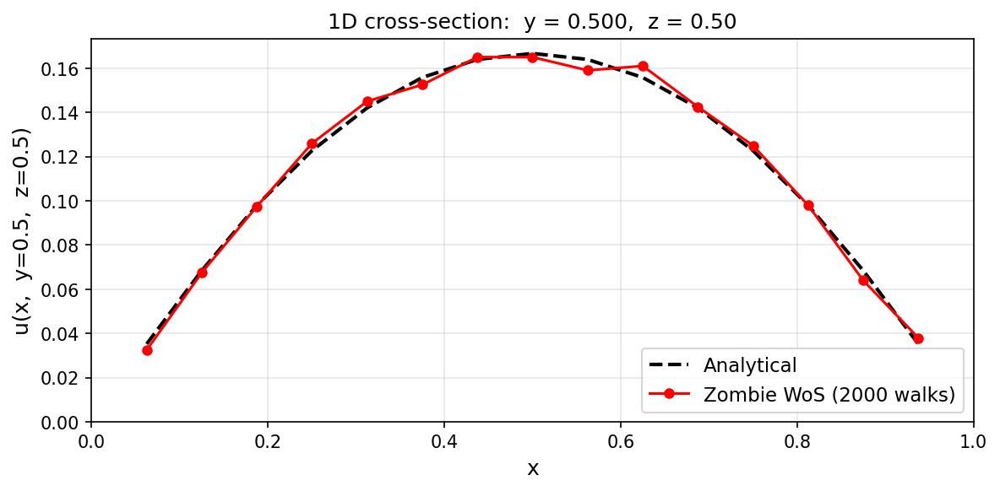
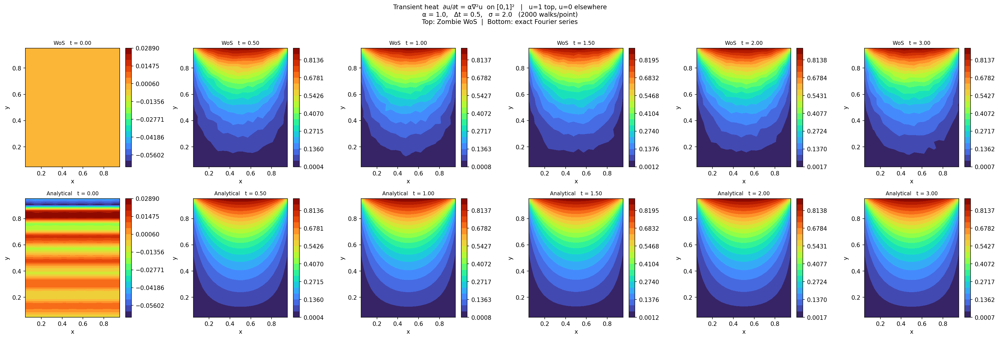
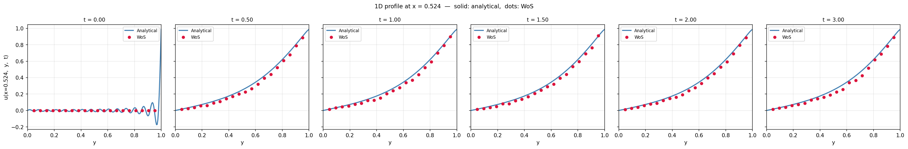
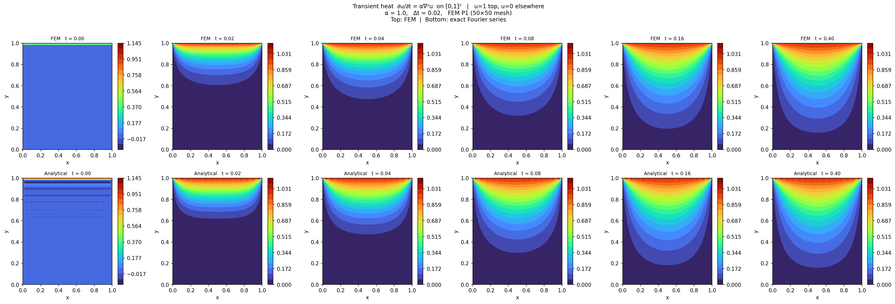

# MontoThermoPOC

A Monte Carlo thermal simulator for solving heat PDEs using the **Walk-on-Stars (WoS)** algorithm via the [zombie](https://github.com/rohan-sawhney/zombie) library. The project explores WoS as a mesh-free alternative to classical solvers (FEM) for steady-state and transient heat problems, with applications in additive manufacturing (3D printing).

Each example is verified against either an analytical solution or a deterministic FEM reference.

---

## Getting Started

### Prerequisites

- Python 3.12
- The [zombie](https://github.com/rohan-sawhney/zombie) Walk-on-Stars library (included as a git submodule)

### Installation

```bash
# Clone the repo with submodules
git clone --recurse-submodules https://github.com/MohammadrezaMoeini/MontoThermoPOC.git
cd MontoThermoPOC

# Create and activate a virtual environment
python3 -m venv ~/.MontoThermoPOC312
source ~/.MontoThermoPOC312/bin/activate

# Install dependencies
pip install -r requirements.txt
```

### Run an example

```bash
python experimentDev/example01/example01.py
```

---

## Examples

### Example 01 — 2D Laplace equation (Walk-on-Stars)

Solves the Laplace equation on the unit square $[0,1]^2$ using the zombie WoS library and compares against the analytical solution.

**PDE & boundary conditions:**

$$\nabla^2 u = 0 \quad \text{on } [0,1]^2$$

| Edge          | Condition |
|---------------|-----------|
| Top ($y=1$)   | $u = 1$   |
| All others    | $u = 0$   |

**Output:**


* Example 1: WoS solution vs analytical — 2D temperature field on $[0,1]^2$


### Example 02 — 3D Laplace equation (Walk-on-Stars)

Extends Example 01 to a 3D unit cube $[0,1]^3$, visualised at three horizontal slices and compared against the analytical double Fourier-series solution.

**PDE & boundary conditions:**

$$\nabla^2 u = 0 \quad \text{on } [0,1]^3$$

| Face        | Condition |
|-------------|-----------|
| Top ($z=1$) | $u = 1$   |
| All others  | $u = 0$   |

**Output:**


* Example 2: Analytical vs Zombie WoS solution and absolute error at three $z$-slices


* Example 2: 3D view of the solution at horizontal slices coloured by temperature


* Example 2: 1D cross-section along $y=0.5$, $z=0.5$ — Analytical vs Zombie WoS


### Example 03 — Transient heat equation (Walk-on-Stars)

Solves the transient heat equation on $[0,1]^2$ using WoS with backward Euler time discretisation and compares against the analytical Fourier-series solution.

**PDE & boundary conditions:**

$$\frac{\partial u}{\partial t} = \alpha \nabla^2 u \quad \text{on } [0,1]^2$$

| Edge          | Condition |
|---------------|-----------|
| Top ($y=1$)   | $u = 1$   |
| All others    | $u = 0$   |

**Initial condition:** $u(x, y, 0) = 0$

**Time discretisation:**

Backward Euler converts the PDE into a screened-Poisson (Yukawa) equation at each step:

$$\nabla^2 u^{n+1} - \sigma\, u^{n+1} = -\sigma\, u^n \qquad \sigma = \frac{1}{\alpha \Delta t}$$

Zombie solves this directly with $\lambda = \sigma$ and source $f = \sigma \cdot u^n$.
At steady state ($u^{n+1} \approx u^n$) the equation collapses back to $\nabla^2 u = 0$, recovering the Example 01 Laplace solution.

**Key constraint — $\sigma$ must stay small:**

The Dirichlet boundary influence on interior points decays as $\exp(-\sqrt{\sigma} \cdot d)$. For large $\sigma$ this signal falls below the MC noise floor, causing the solution to stagnate. Two diagnostic experiments confirmed this:

- **Increasing N\_walks 10×** (2 000 → 20 000) with $\sigma = 50$: error unchanged — not a variance issue
- **Reducing $\sigma$** from 50 to 2 ($\Delta t$: 0.02 → 0.5): mean error dropped 9× — confirmed root cause

| Parameter  | Value                |
|------------|----------------------|
| dt         | 0.5 s                |
| sigma      | 2                    |
| N\_steps   | 6 (t\_final = 3.0 s) |
| N\_walks   | 2 000                |
| Mean error | 0.017                |

**Output:**


* Example 3: WoS (top) vs analytical (bottom) temperature field at six time snapshots


* Example 3: 1D profile at $x=0.5$ — analytical (line) vs WoS (dots) at each saved time


### Example 04 — Transient heat equation (FEM reference)

Solves the same problem as Example 03 deterministically using the **Finite Element Method** (P1 linear triangles) as a benchmark for the WoS results.

**Time discretisation:**

Backward Euler with the FEM system matrix $A = M + \alpha \Delta t\, K$ (factored once via LU):

$$A\, u^{n+1} = M\, u^n$$

where $M$ is the consistent mass matrix and $K$ is the stiffness matrix assembled from P1 shape functions on a uniform $50 \times 50$ triangle mesh.

**Output:**


* Example 4: FEM (top) vs analytical (bottom) temperature field at six time snapshots


* Example 4: 1D profile at $x=0.5$ — analytical (line) vs FEM (dots) at each saved time


* Example 4: WoS (example03) vs FEM vs Analytical — 1D profile at $x=0.5$, backward Euler $\Delta t=0.5$, $\sigma=2$

---

## License

This project is licensed under the **GNU Affero General Public License v3.0 (AGPL-3.0)**. See [LICENSE](LICENSE) for details.

For commercial use, please contact the author.