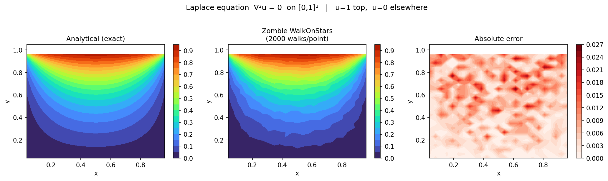
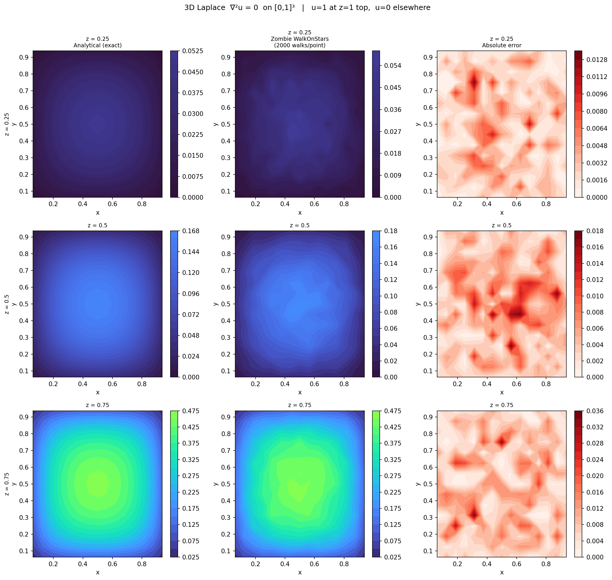
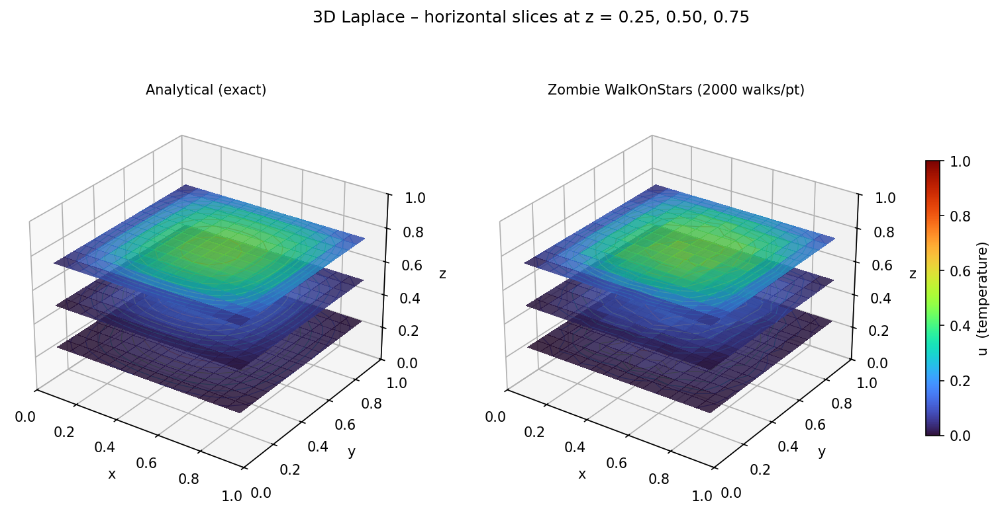
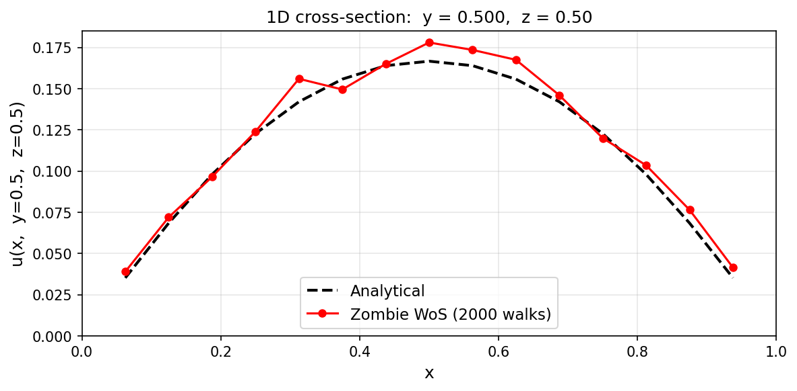
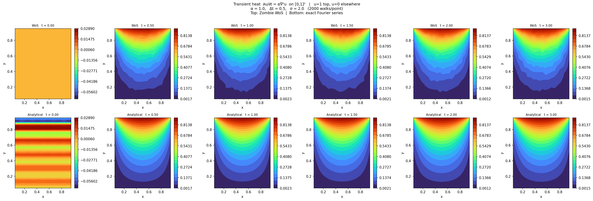
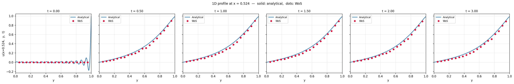
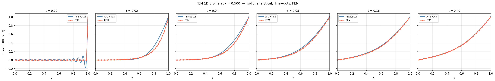
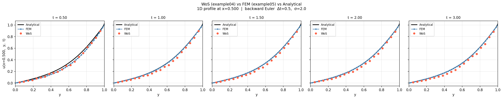

# MontoThermoPOC: 
This is a thermal simulator by MC. 

# Examples
In experimentDev folder, there are verification and validation examples. 

## Example 01:
This example is a first draft of Monte Carlo simulation from scratch without using any library.

## Example 02:
In this example, a 2D heat problem was solved with zombie library. 
### PDE & B.C.
The equation that we solved is laplace equation and with Dirichlet boundary conditions: 

$ \nabla^2 u = 0$ on $[0,1]^2$
                                                                                                                                                                                                                                         
  **Boundary conditions (Dirichlet):**                                                                                                                                                                                                   
                                                                                                                                                                                                                                         
  | Edge   | $(x, y)$ | Condition |                                                                                                                                                                                                            
  |--------|----------|-----------|
  | Bottom | $y=0$    | $u = 0$   |
  | Left   | $x=0$    | $u = 0$   |
  | Right  | $x=1$    | $u = 0$   |
  | Top    | $y=1$    | $u = 1$   |

### Output
The output would be the predicted temprature inside the target domain of [0, 1]

* Example 2: Solving laplace equation using zombie library and comparing the analytical solution

## Example 03:
In this example, the 3D Laplace equation was solved on the unit cube $[0,1]^3$ using the zombie Walk-on-Stars library.

### PDE & B.C.

$$
\nabla^2 u = 0 \quad \text{on } [0,1]^3
$$

**Boundary conditions (Dirichlet):**

| Face        | Condition |
|-------------|-----------|
| Top ($z=1$) | $u = 1$   |
| All others  | $u = 0$   |

### Output
The solution is visualised at three horizontal slices ($z = 0.25$, $0.50$, $0.75$), each compared against the analytical double Fourier-series solution.

* Example 3: Analytical vs Zombie WoS solution and absolute error at three $z$-slices

* Example 3: 3D view of the solution at horizontal slices coloured by temperature

* Example 3: 1D cross-section along $y=0.5$, $z=0.5$ — Analytical vs Zombie WoS

## Example 04: 
In this example, the transient heat equation was solved on $[0,1]^2$ using the zombie Walk-on-Stars library with a backward Euler time discretisation.

### PDE & B.C.

$$
\frac{\partial u}{\partial t} = \alpha \nabla^2 u \quad \text{on } [0,1]^2
$$

**Boundary conditions (Dirichlet):**

| Edge          | Condition |
|---------------|-----------|
| Top ($y=1$)   | $u = 1$   |
| All others    | $u = 0$   |

**Initial condition:** $u(x, y, 0) = 0$

### Time discretisation

Backward Euler converts the PDE into a screened-Poisson (Yukawa) equation at each step:

$$
\nabla^2 u^{n+1} - \sigma\, u^{n+1} = -\sigma\, u^n \qquad \sigma = \frac{1}{\alpha \Delta t}
$$

Zombie solves this directly with $\lambda = \sigma$ and source $f = \sigma \cdot u^n$.
At steady state ($u^{n+1} \approx u^n$) the equation collapses back to $\nabla^2 u = 0$, recovering the Example 02 Laplace solution.

### Key constraint: $\sigma$ must stay small

The Dirichlet boundary influence on interior points decays as $\exp(-\sqrt{\sigma} \cdot d)$. For large $\sigma$ this signal becomes undetectable, causing the solution to stagnate. Two diagnostic experiments confirmed this:

- **Increasing N\_walks 10×** (2 000 → 20 000) with $\sigma = 50$: error unchanged — not a variance issue
- **Reducing $\sigma$** from 50 to 2 ($\Delta t$: 0.02 → 0.5): mean error dropped 9× — confirmed root cause

The working parameters use $\sigma = 2$:

| Parameter | Value |
|-----------|-------|
| dt | 0.5 s |
| sigma | 2 |
| N\_steps | 6 (t\_final = 3.0 s) |
| N\_walks | 2 000 |
| Mean error | 0.017 |

### Output
Snapshots at $t = 0,\, 0.5,\, 1.0,\, 1.5,\, 2.0,\, 3.0$ compared against the analytical Fourier-series solution.

* Example 4: WoS (top) vs analytical (bottom) temperature field at six time snapshots

* Example 4: 1D profile at $x=0.5$ — analytical (line) vs WoS (dots) at each saved time

## Example 05: 
This example solves the same transient heat problem as Example 04, but deterministically using the **Finite Element Method** (P1 linear triangles) instead of Walk-on-Stars. It serves as a reference solver to benchmark the WoS results.

### PDE & B.C.

$$
\frac{\partial u}{\partial t} = \alpha \nabla^2 u \quad \text{on } [0,1]^2
$$

**Boundary conditions (Dirichlet):**

| Edge          | Condition |
|---------------|-----------|
| Top ($y=1$)   | $u = 1$   |
| All others    | $u = 0$   |

**Initial condition:** $u(x, y, 0) = 0$

### Time discretisation

Backward Euler with the FEM system matrix $A = M + \alpha \Delta t\, K$ (factored once via LU):

$$
A\, u^{n+1} = M\, u^n
$$

where $M$ is the consistent mass matrix and $K$ is the stiffness matrix assembled from P1 shape functions on a uniform $50 \times 50$ triangle mesh.

### Output

* Example 5: FEM (top) vs analytical (bottom) temperature field at six time snapshots

* Example 5: 1D profile at $x=0.5$ — analytical (line) vs FEM (dots) at each saved time

* Example 5: WoS (example04) vs FEM vs Analytical — 1D profile at $x=0.5$, backward Euler $\Delta t=0.5$, $\sigma=2$

## Example 06: Wrong! 
This example applies the transient thermal solver to a real G-code print job (a 20 mm box). It tracks the temperature history at **three vertical positions** inside a single bead — bottom, middle, and top — to visualise the vertical thermal gradient during deposition and cooling.

### Setup

The simulation uses the `GCodeTransientSimulator` which parses the G-code, builds a bead mesh for each move, and calls `TransientThermalSolver` with a `(1, 1, 3)` grid (one $x$-, one $y$-, three $z$-points). The longest bead from the first 30 moves is selected for analysis.

**Material / boundary parameters:**

| Parameter    | Value      |
|--------------|------------|
| T nozzle     | 200 °C     |
| T bed        | 60 °C      |
| T ambient    | 20 °C      |
| h            | 25 W/m²K   |
| k            | 0.2 W/mK   |
| rho          | 1240 kg/m³ |
| cp           | 1800 J/kgK |
| dt           | 0.2 s      |

### Output

The full thermal history (deposition phase + 15 cooling steps) is plotted for each of the three $z$-points. The nozzle-top point heats rapidly and then drops sharply once the nozzle leaves; the bed-bottom point stays close to $T_\text{bed}$ throughout.

* Example 6: Temperature vs time at z_bottom, z_middle, and z_top inside a bead

## Example 07: Validation against Trofimov 2022 Wrong!

This example validates the `TransientThermalSolver` against the experimental IR thermography data published in:

> Trofimov, A. et al. (2022). *Experimentally validated modeling of temperature distribution during FFF.*

The paper provides 27 measured T vs time curves at known coordinates on a printed PLA plate. The solver is run on the same geometry (geometry a — 60 × 10 × 4 mm regular plate) and the predictions at the 9 layer-1 validation points (#1–9) are compared against the experimental and FEM reference curves.

### Geometry & coordinate transform

The GCode file uses a centred coordinate system. Paper coordinates are transformed as:

$$
x_\text{gcode} = x_\text{paper} - 4.4 \qquad y_\text{gcode} = y_\text{paper} - 29.52
$$

Layer 1 validation points sit at $z = 0.2$ mm (mid-layer).

| Point | Bead x (gcode) | y (gcode) |
|-------|----------------|-----------|
| #1    | −4.0 mm        | −29.12 mm |
| #2    | −4.0 mm        |   0.08 mm |
| #3    | −4.0 mm        |  14.48 mm |
| #4–6  | −0.4 mm        | same y    |
| #7–9  | +4.4 mm        | same y    |

### Material & solver parameters (Trofimov 2022, Table 2)

| Parameter        | Value      |
|------------------|------------|
| T nozzle         | 210 °C     |
| T bed            | 52 °C      |
| T ambient        | 20 °C      |
| h (free surface) | 71 W/m²K   |
| k                | 0.11 W/mK  |
| rho              | 1250 kg/m³ |
| cp               | 1590 J/kgK |

### Method

All 23 layer-1 beads are simulated in sequence. For the three validation beads the moving-nozzle `solve_incremental_deposition` is used so each query point receives $T_\text{nozzle}$ exactly when the nozzle passes over it. The mean grid temperature is carried forward as the initial condition between beads.

### Output

* Example 7: MC WoS prediction vs experimental IR data vs FEM reference at layer-1 points #1–9

The convergence studies (n_walks and dt) for point #1 are also included:

* Example 7: MC temperature vs n_walks at t = 0.5 s after nozzle arrival (point #1)

* Example 7: MC temperature vs dt at point #1 (n_walks = 512)

